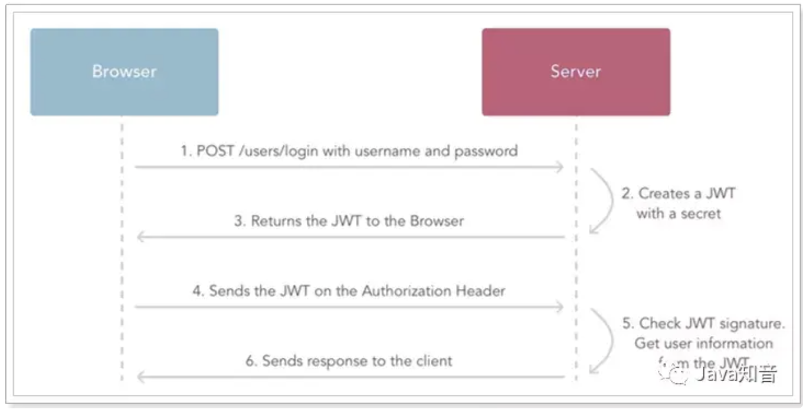

# AUTH
## JWT
### JWT 信息组成
1.header
 alg:定义加密算法
 type:描述认证类别
 ```
 {
  "alg": "HS256",
  "typ": "JWT"
 }
 ```
2.payload
 用户信息
 expi过期时间
 
 ```
 {
  "sub": "1234567890",
  "name": "John Doe",
  "iat": 1516239022
 }
 ```
3.signature
base64 【header 拼接 payload信息】
并使用alg 结合secret进行加密
```
HMACSHA256(
  base64UrlEncode(header) + "." +
  base64UrlEncode(payload),
  secret
)
```

2.verify 的过程

客户端请求中的token，使用服务器端保留的secret对于singnature进行解密，解密内容若与header 以及 payload信息一致，则确认token有效。从而在payload 中获取用户信息。




## AUTH2.0
### Auth2.0四种模式
#### 授权码模式

