# Flex
## Flex-layout 布局的概念
Flexbox 布局，弹性盒子布局。目标：提供更为有效，对齐方式，且能够使父元素在子元素的大小未知的或动态变化的情况下人能够有效的控制子元素之间的排列方式。
主要思想：父元素中设定的内容属性有效的作用与子元素的宽度，高度，排列方式。设定为flex布局的元素子元素能够依据父元素的大小自动的适应调整。

使用场景：flex布局适用于规模较小的布局。可以简单，完整，响应式的实现各种布局。但设定为flex布局后，其子元素的float,clear与vertical-aligin 属性将失效。

优势：flex 弹性布局在于声明式布局行为，无需给出具体的实现方式。浏览器完成实际的布局，当布局涉及到不定的狂赌，分布对齐的场景时，优先考虑弹性式布局。


## Overview

Flex 布局是一个完整的模块，其具有一整套的属性。采用flex 布局的元素称之为容器布局。其所有的子元素为容器成员-item
容器默认存在两个轴:
水平轴【main axis】
垂直轴【cross axis】
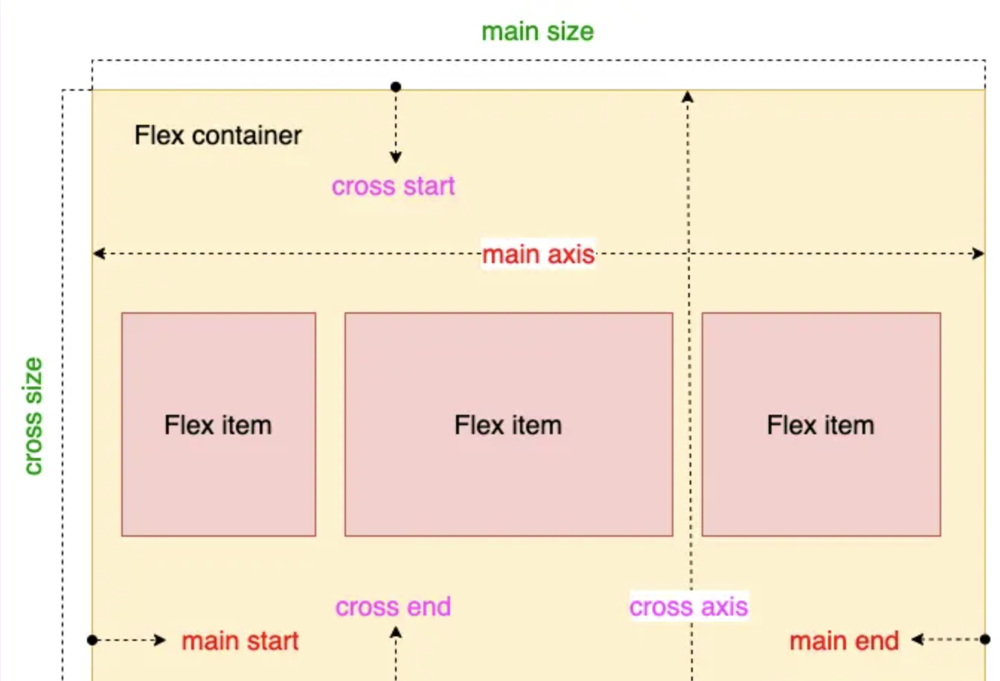

main-axis:
main-start:
main-end:
main-size:子元素在主轴上的大小

cross-axis:
cross-start:
cross-end:
croess-size:子元素在交叉轴上的大小

## 父元素的属性
### disply:
```disply:flex|inline-flex```
- flex :子元素为块级元素，且遵从flex布局方式
- inline-flex：子元素为行内元素

### flex-direction -主轴方向
```
.container {flex-direction:row|row-reverse|column|column-reverse}
```
### flex-warp-容器内元素是否可以换行
```flex-warp: warp|nowarp|warp-reverse```
默认值：default value is nowarp
当主轴空间长度一定，且空间不足时，子元素尺寸会随之调整，不进行换行
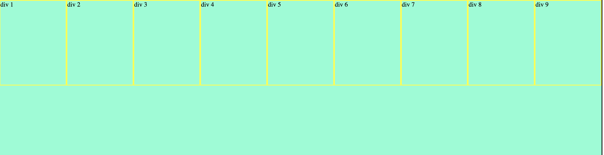

当设定flex-warp 的属性值为warp
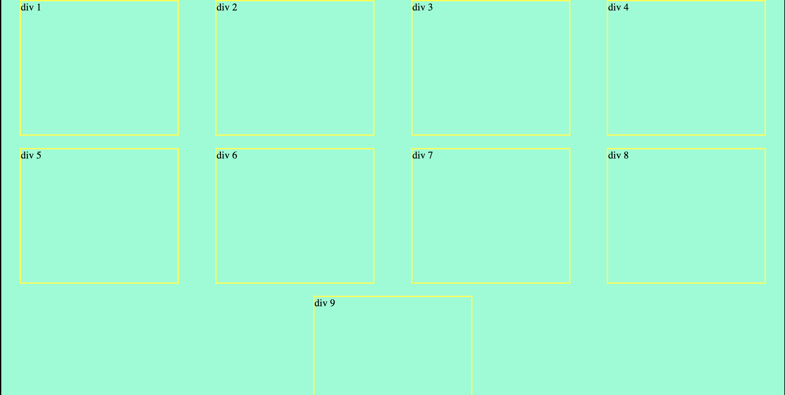

当设定flex-warp的属性值为warp-reverse
换行的调转，原第一行会重置在最后。针对为行的倒置

### flex-flow -flex-direction & flex-warp的简写。
default value:
```
.comtainer {
    flex-flow:flex-direction flex-warp
}
```

### justify-content --元素的主轴方向对齐的方式
```
justify-content:flex-start|flex-right|center|space-between|space-around 
```
- flex-satrt
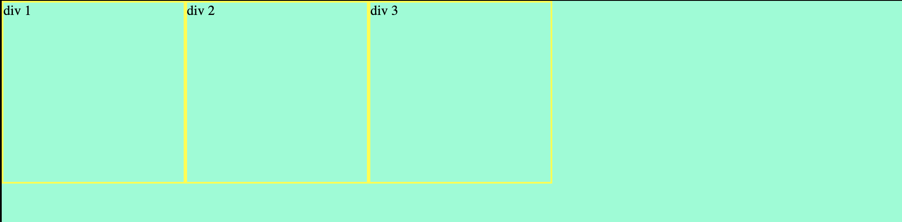
- flex-center
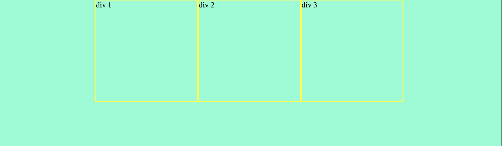
- space-between
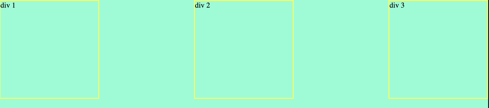
- space-around
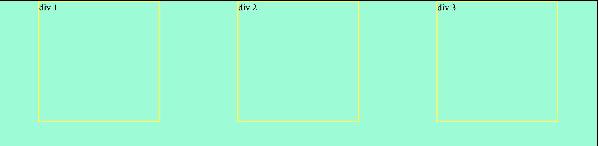
  
### align-items -子元素在交叉轴上对齐方式
```
 align-items:flex-start|flex-end|center|space-between|space-around
```

### 补充--使用jsutify-content&align-items实现子元素居中
```
.container {
    /*关键属性值的设定*/
    justify-content:center; 
    align-items:center;
}
```
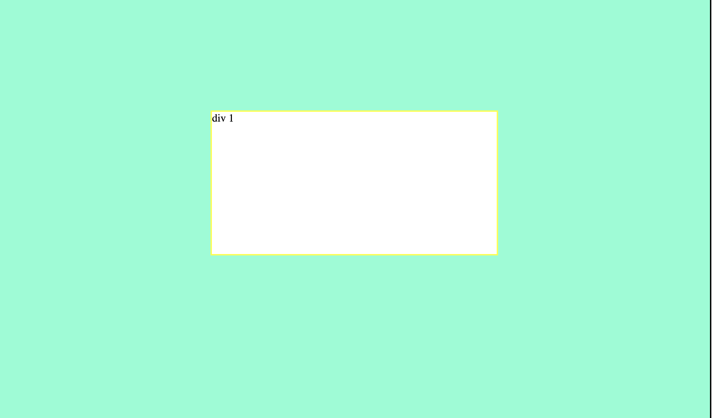

### align-content -- 多根轴线的对齐方式【当flex-warp:warp】可能存在多根主轴线
```
.container {
    align-content: flex-start | flex-end | center | space-between | space-around | stretch;
}
```
[align-content-online-demo](https://developer.mozilla.org/zh-CN/docs/Web/CSS/align-content)

## 子元素的属性
### order --定义子元素的排列顺序，默认值为0.值小顺序靠前
```
 .item {
    order:<integer>
 }
```
可自定义value从而有效实现子元素的自定义排列顺序
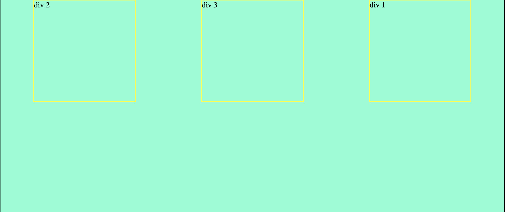
### background
[CSS flex属性深入理解](https://www.zhangxinxu.com/wordpress/2019/12/css-flex-deep/)
在Flex布局中，一个Flex子项的宽度是由元素自身尺寸，flex-basis设置的基础尺寸，以及外部填充（flex-grow）或收缩（flex-shrink）规则3者共同决定的。
- flex-basis
  子元素的固定尺寸【最基础尺寸值】<= 最终的子元素的尺寸值
- flex-grow
   若父元素空间足够大，满足子元素的flex-basis之后，仍有空余空间，则子元素对于空余空间的占比分配。默认值为0,即就是不分配剩余空间
- flex-shrink
   父元素空间不足时，默认值为1，即就是默认进行分配。

默认的语法：
```
flex: none | auto | [ <'flex-grow'> <'flex-shrink'>? || <'flex-basis'> ]
```

### flex-basic--定义在分配多余空间之前，项目占据主轴的空间
当主轴设置为水平时，当设置了 flex-basis，设置的项目宽度值会失效，flex-basis 需要跟 flex-grow 和 flex-shrink 配合使用才能生效。有两种特殊的值：
当 flex-basis 值为 0 % 时，项目尺寸会被认为是0，因此无论项目尺寸设置多少都用；
当 flex-basis 值为 auto 时，则跟根据尺寸的设定值来设置大小。

注意点：
- flex-basic 的优先级高于width
- flex-basic 若设定的值为auto时，其本身的子元素尺寸生效。即就是若此时定义了width 则子元素的尺寸与width相同

当设定子元素的width:100px；以及子元素flex-basis:100px
可看到flex-basis的width 会随着content的尺寸变化。而设定为width 则不会变更
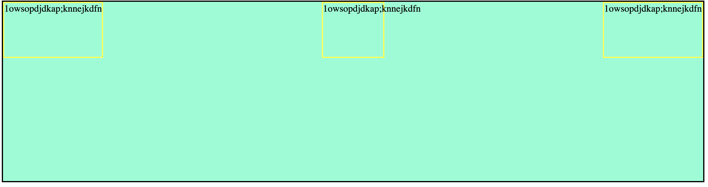
结论：设定子元素的属性flex-basis的场合
content + flex-basis:100px = max(content, flex-basis) = 大于等于100px

### flex-grow --定义项目的放大比例 default is 0
若父元素空间有剩余的场合，则在父元素空间变更时，通过定义该属性则可有效的对于剩余空间进行在分配

### flex-shrink --定义项目的缩小比例 default is 1
当父元素空间不足时，通过定义该属性值可定义子元素缩小的比例。数值越大的场合，其对应子元素缩小的比例越大。

### aligin-self --允许子元素有自己的对齐方式[权值大于align-items]
该属性的属性值与`align-items` 是一致的，只不过当前属性适用于单个子元素。
```
.item {
     align-self: auto | flex-start | flex-end | center | baseline | stretch;
}
```
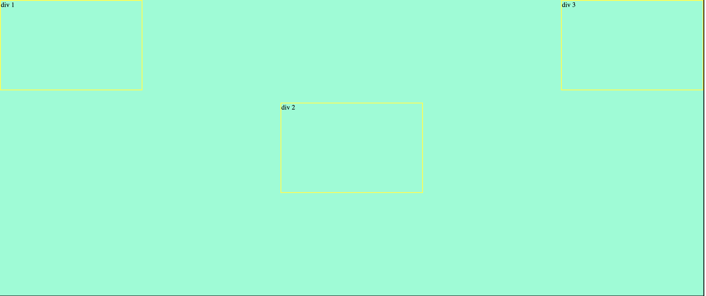

