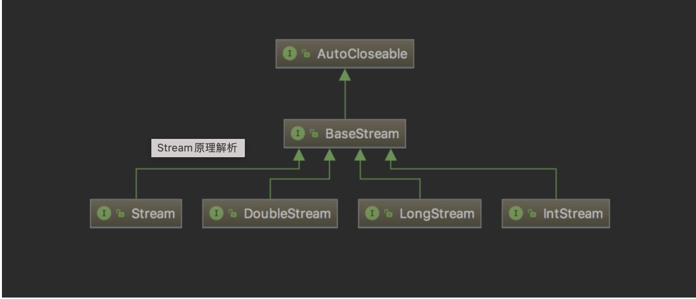
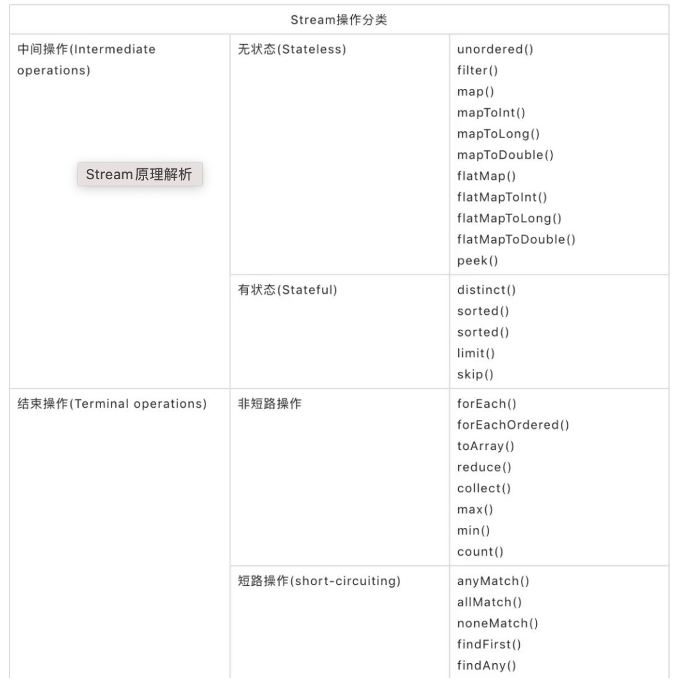

# JAVA 基础知识
## JDK1.8 lambda
lambda表达式【闭包】将函数作为方法的参数，传递到方法中。使用lambda使代码更为简洁

### 使用场景
简化接口的实现。接口的实现存在多种方式：设计接口的实现类，使用匿名内部类。但lambda 更为有效简单.lambda 只能实现函数式接口
```
package com.lambda;

public interface LambdaInterface {
    void test();
}

```

```
package com.lambda;

public class LambdaDemo {
    public static void main(String[] args) {
        LambdaInterface la = () -> {
            System.out.println("hello world");
        };
        la.test();
    }
}

```
```
hello world
```

### 函数式接口
一个接口中，要求实现类必须实现的抽象方法只有一个时，为函数式接口

### 语法
lambda 表达式的本质就是一个匿名函数。因此秩序奥关注方法参数，已方法体的实现。无需关注方法名称，以及方法的返回值等。
``` parameter->expression ```
当参数为多个的场合，使用（）对于参数进行包裹.
```(paramter1,paramter2)->expression```

注意点：
表达式其必须立即返回一个返回值。其表达式的方式有限。不能包含变量，赋值操作，判断，或者循环语句。可以使用`{}`对复杂处理进行操作

### 函数引用
- 引用静态方法
  ClassName::方法名
- 非静态方法的引用
  instance::方法名
### Java中的lambda 实现闭包
在lambda表达式出现之前，java中是没有函数的概念的。和函数差不多相当的就是方法了。

在方法内部可以定义方法的局部变量。我们无法在方法内部定义方法，但是我们可以在方法内部定义匿名类。那么这个匿名类是可以访问方法中定义的局部变量的。如下例所示：
```
public Runnable createClosureUsingClass(){
        int count=10;
        Runnable runnable= new Runnable() {
            @Override
            public void run() {
                System.out.println(count);
            }
        };
        return runnable;
    }
```

## JAVA1.8中的Stream 特性
### Stream 作用
Stream 是Java 1.8中处理集合的抽象概念。其可对于集合进行查找，过滤，筛选等。从而使代码更为简洁，多核友好。
### Stream 中的接口继承关系


### Stream 原理
- 无存储
Stream 不是一种数据解构。只是简单一种视图。数据元可以是一个数组，或容器或IO channel

- 为函数式编程
  对于stream的操作都不会修该背后的数据源。如对于list进行过滤，其不会删除被过滤的元素，只是回一句获取的元素构建一个新的stream

- 惰性执行
Stream 的操作不会立即执行

- 可消费性
Stream 自能被消费一次。一旦遍历过后stream即就是被关闭。从而再次遍历需要重新创建stream

### Stream 的操作



- 中间操作
 中间操作总是惰性执行。中间操作只是生成了一个标记了该操作的stream而已。中间操作亦可分为【Stateless】&&【Stateful】.无状态指的是后面元素的处理不受前处理元素的影响。有状态反之。例如排序操作，只有读取全部元素之后才能形成有序
- 关闭操作
关闭操作可分为短路操作与非短路操作，短路值不用返回所有的元素即可终了

注意点：通常，返回值为stream的为中间操作。

### 应用步骤
1. 创建流对象
2. 对于流对象进行中间操作
3. 关闭流对象

### 实例
```
        personList.stream().filter((p)->p.getCountry().equals("China")).forEach(System.out::println);
```

